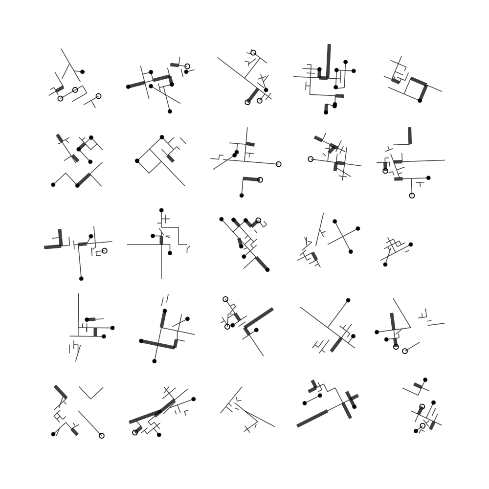
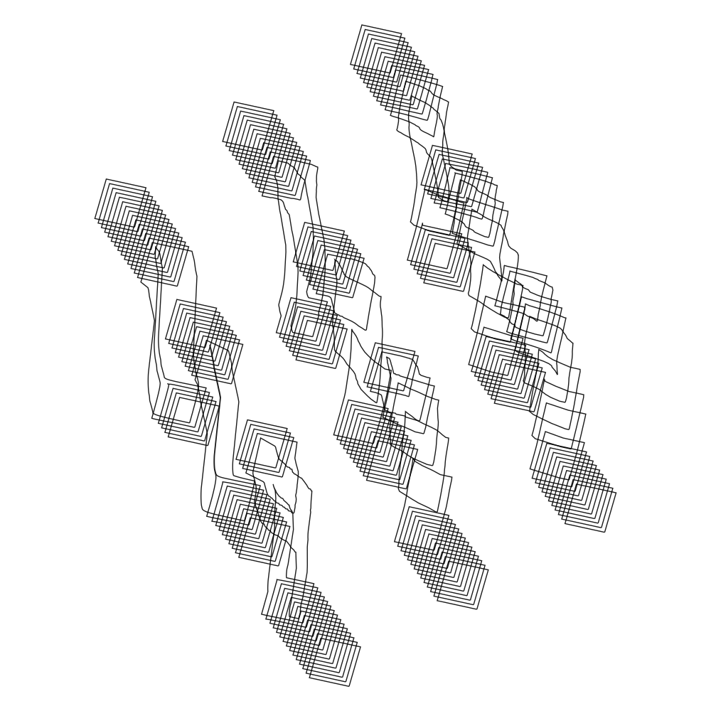

# AUXIN-Auxiliary Utilities for Generative Art

**NOTE: This code is likely to change with little or no warning. You should not
use this for anything remotely important. Make sure to clone the repo if you
need it to remain stable.**

## About

This system is auxilary utilities i have found useful for working with
generative algorithms it is primarily intended for use with my grph library
(https://github.com/inconvergent/cl-grph) and my vector mathematics library
(https://github.com/inconvergent/cl-veq). Auxin is a stripped down fork of
weird (https://github.com/inconvergent/weird).


## Components

Here are the main components: TODO

3. Random numbers, some examples:

   ```lisp
   (in-package :rnd)
   (rnd a) ; in range [0.0, a), defaults to a=1.0.
   (rnd* a) ; in range [-a, a), defaults to a=1.0.
   (rndrng a b) ; in range [a, b)
   (rndi 10) ; random fixnum
   (rndspace n a b) ; n numbers in [a, b)
   (norm :mu 0.0 :sigma 1.0) ; normal distribution
   (2in-circ a) ; in circle of radius a
   (2in-rect w h) ; in a rectangle
   (2nin-rect n w h) ; n in rectangle.
   (2on-line ax ay bx by) ; point between points a and b

   ; do something with probability 0.1, second form is optional
   (prob 0.1 (print "10% hi") (print "90% oh no"))

   ; perform either form 1 or (optionally) 2
   (either (print "form 1") (print "form 2"))
   ```

   See [rnd.lisp](src/rnd/rnd.lisp), [2rnd.lisp](src/rnd/2rnd.lisp) and
   [3rnd.lisp](src/rnd/3rnd.lisp), for all available functions.

4. A tool for drawing `svg` files: `wsvg`. See [draw.lisp](/examples/draw.lisp).

5. TODO add more description

In addition the library contains a number of useful tools for dealing with
(predominantly) vector graphics.







## On Use and Contributions

This code is written for my personal use, and parts of it is rather
experimental. Also, it is likely to change at my whim. For this reason I don't
recommend depending on this library for anything.

I release it publicly in case people find it useful or interesting. It is not,
however, intended as a collaboration/Open Source project. As such I am unlikely
to accept PRs, reply to issues, or take requests.


## Installation and Dependencies

`auxin` depends on [cl-veq](https://github.com/inconvergent/cl-veq), and
it requires Quicklisp to install dependencies (which are listed in
`auxin.asd`).

To install and load `auxin`, do:
```lisp
(ql:quickload :auxin)
```
If this does not work, `auxin` may not be in a place Quicklisp or ASDF can see
them. To fix this, either:
```lisp
(load "auxin.asd")
```
For a long term solution, add the following to `.sbclrc`:
```lisp
#+quicklisp
(push "/path/to/dir/containing/auxin" ql:*local-project-directories*)
```
You will have to make sure `cl-veq` is also available in the same fashion for
any of this to work.

### Tests

Tests can be executed using: `(asdf:test-system :auxin)`.

